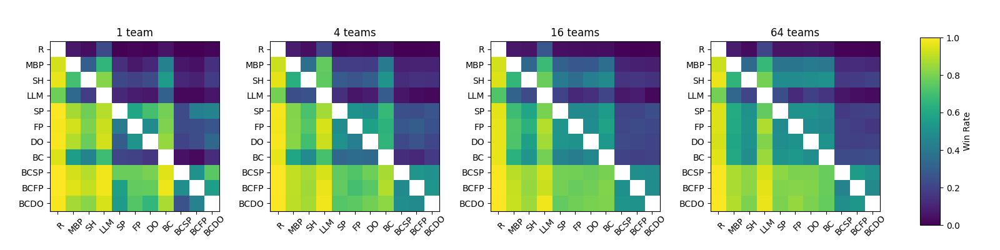

# VGC Pokémon Showdown AI

A reinforcement-learning agent that plays competitive VGC doubles (Regulation
M-B) on the real Pokémon Showdown ladder. The policy is a PPO transformer
fine-tuned with fictitious play against a league that includes a
human-imitation model cloned from ~14,000 top-player games; candidates earn
deployment by surviving 25,000-battle gate batteries against opponent
populations they never trained on, a memorization check against a held-out
human model, and audited live-ladder rollouts. Its first 100 ranked games:
**55-45, peaking at 1365 Elo** — beating the previous generation's lifetime
peak within its first session.

## ⚔️ Face the bot

The bot plays on the official Showdown server as
[**antonius1**](https://pokemonshowdown.com/users/antonius1), format
**[Gen 9] Champions VGC 2026 Reg M-B**.

- **Challenge it:** open [play.pokemonshowdown.com](https://play.pokemonshowdown.com),
  click *Find a user*, type `antonius1`, and send a challenge in the Reg M-B
  format. It accepts automatically whenever a session is live — it runs on a
  laptop, not a server farm, so if it's offline, try again later or watch a
  replay instead.
- **Watch it play:** [recent replays](https://replay.pokemonshowdown.com/?user=antonius1)
  · [ladder profile & rating](https://pokemonshowdown.com/users/antonius1)

(Owner: host a challenge session with
`python ladder_ourteam.py --checkpoint results_league/league_champion.zip --challenges --n_games 5 --replay_dir ladder_replays_challenges`.)

## Built on VGC-Bench

The training and evaluation framework underneath is
[VGC-Bench](https://github.com/cameronangliss/vgc-bench)
([paper](https://arxiv.org/abs/2506.10326)) by Cameron Angliss, extended here
with the league fine-tuning pipeline, content-verified opponent pools, exact
game-tree search over the bundled simulator, opponent/tempo rerankers, a
calibrated outcome value net, ladder audit instrumentation, and the gate
battery that decides what ships. Framework capabilities include PSRO-style
multi-agent RL, a behavior-cloning pipeline over human demonstrations, an LLM
player, and heuristic baselines from
[poke-env](https://github.com/hsahovic/poke-env). Setup instructions below
are the framework's.

# 🛠️ Setup
Prerequisites:
1. Python (I use v3.13)
1. NodeJS and npm (whatever pokemon-showdown requires)

Run the following to ensure that pokemon showdown is configured:
```
git submodule update --init --recursive
cd pokemon-showdown
npm i
node pokemon-showdown start --no-security
```
Let that run until you see the following text:
```
RESTORE CHATROOM: lobby
RESTORE CHATROOM: staff
Worker 1 now listening on 0.0.0.0:8000
Test your server at http://localhost:8000
```
This shows that you can locally host the showdown server.

Install project dependencies by running:
```
pip install .[dev]
```
NOTE: if this doesn't work due to the `open-spiel` dependency, feel free to remove it in `pyproject.toml`. It is only necessary for the `vgc_bench/eval` module.

If the project doesn't work at first, the reason is usually that one of the following is not up to date:
1. vgc-bench itself (remember to pull from this repo as changes come in for the latest fixes/updates)
1. pokemon-showdown (pinned as a submodule in this repo, YOU HAVE TO USE THE ONE PINNED HERE)
1. poke-env (pinned in pyproject.toml and updated frequently; just because you have it pip installed doesn't mean it is the latest version!)

# 👨‍💻 How to use

NOTE: Unless you're playing your policy on the live Pokémon Showdown servers with [play.py](vgc_bench/play.py), you must locally host your own server by running `node pokemon-showdown start <PORT> --no-security` from `pokemon-showdown/` (done automatically if using bash scripts).

All `.py` files in `vgc_bench/` are runnable modules and (with the exception of [scrape_data.py](vgc_bench/scrape_data.py) and [visualize.py](vgc_bench/visualize.py)) have `--help` text. Run them from the repo root, e.g. `python -m vgc_bench.train`. By contrast, all `.py` files in `vgc_bench/src/` are not modules, and are not intended to be run standalone.

## Exact multi-turn planning and conservative distillation

This fork uses the bundled Champions simulator both as an offline planning teacher
and, after parity/latency gates pass, as a bounded live move planner. It searches
complete simultaneous turns, likely opponent replies, hidden sets, chance outcomes,
forced replacements, and Team Preview plans. Search leaves use a calibrated final-win
evaluator rather than the old PPO critic alone.

```bash
python run_iterative_training.py --rounds 1
```

Each round is resumable and sequential: four CPU workers generate 50/50 open/hidden
exact labels, then one MPS trainer fits a confidence-gated residual while every PPO
champion parameter stays frozen. The best three epochs are evaluated against matched
open-sheet, hidden-sheet, and learned-policy populations. Preview control is not
changed until at least 1,500 genuine planner preview labels exist.

The exact live path is gated by 1,000-state snapshot parity, hidden-set coverage, and
a hard ten-second submission limit. Run the final 500-battle-per-mode local gate only
for a selected residual:

```bash
python run_rollout_gate.py \
  --candidate results_iterative_v2/round_01/results/candidate.zip \
  --residual results_iterative_v2/round_01/results/candidate_residual.pt
```

That gate records every loss, replay, fallback, timeout, and exact-search latency, and
writes a new deployment manifest without replacing `results_repaired/champion.zip`.
`ladder_ourteam.py` can consume a passed manifest; ladder games remain serial.

Live exact play uses selective chess-style thinking by default. An important position
receives a bounded foreground search and saved continuations are reused only when the
next public state, opponent action, legal actions, and hidden-world consensus match;
otherwise the planner searches again or falls back to champion plus factual guards.
Background pondering remains available for experiments but is off by default because
only four of 189 ladder jobs matched the observed continuation. `--search-every-turn`
and `--ponder` are explicit A/B controls.

After the first audited ladder gate exposed live-only timing, repeated-Tailwind, and
hidden-world refresh defects, the live search budget was reduced to eight seconds and
the exact rankings were put through the production factual guards. The current local
gate over 30 mixed open/hidden decisions measured 7.82s p50, 8.09s p90, 8.54s maximum,
zero genuine planner fallbacks, and zero missed submissions while retaining all eight
hidden worlds. After the audited Encore-lock and no-weather Weather Ball repairs, the
expanded verification totals are 189 repository tests and 18/18 permanent tactical
fixtures. The repaired champion remains unchanged until the rollout gates pass.

## 🏆 Population-based Reinforcement Learning

The training code offers the following PSRO algorithms:
- pure self-play
- fictitious play
- double oracle method
- policy exploitation

...as well as some special training options:
- initializing the policy with the output of the BC pipeline; if `--behavior_clone` is enabled and no local BC checkpoint is present, `vgc_bench.train` automatically downloads [`results/saves_bc/seed1/100.zip`](https://huggingface.co/cameronangliss/vgc-bench-models/blob/main/results/saves_bc/seed1/100.zip) from the [vgc-bench-models](https://huggingface.co/cameronangliss/vgc-bench-models) model repo
- frame stacking with specified number of frames
- excluding mirror matches (p1 and p2 using the same team)
- starting agent with random teampreview at the beginning of each game
- matchup solving with specific team strings (pass both `--team1` and `--team2` to train on a single matchup)

See [train.sh](train.sh) for running multiple training runs simultaneously with automatic pokemon-showdown server management, or [train_matchup.sh](train_matchup.sh) for an example of training on a specific team matchup.
If you don't want to run `train.py` yourself, pre-trained models are available in [vgc-bench-models](https://huggingface.co/cameronangliss/vgc-bench-models).

## 📚 Behavior Cloning

1. [scrape_logs.py](vgc_bench/scrape_logs.py) scrapes logs from the [Pokémon Showdown replay database](https://replay.pokemonshowdown.com), automatically filtering out bad logs and only scraping logs with open team sheets (OTS)
    - optional parallelization (strongly recommended)
    - if you don't need logs after 05/04/2026, just download our pre-scraped dataset of logs from [vgc-battle-logs](https://huggingface.co/datasets/cameronangliss/vgc-battle-logs) and place the files in `battle_logs/`
1. [logs2trajs.py](vgc_bench/logs2trajs.py) parses the logs into trajectories composed of state-action transitions
    - optional parallelization (strongly recommended)
    - `--min_rating` and `--only_winner` can be used to filter out low-Elo and losing trajectories respectively
1. [pretrain.py](vgc_bench/pretrain.py) uses the gathered trajectories to train a policy with behavior cloning
    - frame stacking with specified number of frames
    - configurable fraction of dataset to load into memory at any given time (if not set low enough, program may run out of memory)
    - see [pretrain.sh](pretrain.sh) for running behavior cloning with automatic pokemon-showdown server management
    - if you don't want to run `pretrain.py` yourself, use the pre-trained BC checkpoint in [vgc-bench-models](https://huggingface.co/cameronangliss/vgc-bench-models)

## 🤖 LLMs

See [llm.py](vgc_bench/src/llm.py) for the provided LLMPlayer wrapper class. We use `meta-llama/Meta-Llama-3.1-8B-Instruct`, but the user may replace logic in the `setup_llm` and `get_response` methods to use a different LLM.

## 🎲 Heuristics

See [poke-env](https://github.com/hsahovic/poke-env) for detailed examples of using the heuristic players. For example:

```python
import asyncio

from poke_env import cross_evaluate
from poke_env.player import MaxBasePowerPlayer, RandomPlayer, SimpleHeuristicsPlayer

random_player = RandomPlayer()
mbp_player = MaxBasePowerPlayer()
sh_player = SimpleHeuristicsPlayer()
results = asyncio.run(cross_evaluate([random_player, mbp_player, sh_player], n_challenges=100))
print(results)
```

## 📊 Evaluation

- [eval.py](vgc_bench/eval.py) runs the cross-play evaluation, performance test, generalization test, and ranking algorithm as described in our paper (see above)
    - see [eval.sh](eval.sh) for running multiple evaluations simultaneously with automatic pokemon-showdown server management
- [play.py](vgc_bench/play.py) loads a saved policy onto the live Pokémon Showdown servers, where the policy can receive challenges from other users or enter the online Elo ladder
- [visualize.py](vgc_bench/visualize.py) processes cross-evaluation results into heatmaps and features conversion functions for LaTeX and Markdown formats

### Cross-evaluation of all AI agents

For each run, 200 battles were used to compare agents, except for LLM player which was compared with 20 battles. The heatmap below averages the results of 5 independent training runs for each trainable agent, accounting for 1000 total battles in each agent comparison, and 100 battles per comparison for the LLM player.



Legend: R = random player, MBP = max base power player, SH = simple heuristics player, LLM = LLM player, SP = self-play agent, FP = fictitious play agent, DO = double oracle agent, BC = behavior cloning agent, BCSP = self-play agent initialized with behavior cloning, BCFP = fictitious play agent initialized with behavior cloning, BCDO = double oracle agent initialized with behavior cloning

### Performance Test

This test compares the performance of the strongest method on average across runs 1-5 of the 1, 4, 16, and 64 team setting with the one team that they all had training exposure to.

| # teams   | 1 (BCSP) | 4 (BCSP) | 16 (BCDO) | 64 (BCSP) |
|-----------|----------|----------|-----------|-----------|
| 1 (BCSP)  | --       | 0.699    | 0.74      | 0.698     |
| 4 (BCSP)  | 0.301    | --       | 0.594     | 0.672     |
| 16 (BCDO) | 0.26     | 0.406    | --        | 0.644     |
| 64 (BCSP) | 0.302    | 0.328    | 0.356     | --        |

### Generalization Test

This test compares the performance of the strongest method on average across runs 1-5 of the 1, 4, 16, and 64 team setting with 72 teams that none of them had training exposure to.

| # teams   | 1 (BCSP) | 4 (BCSP) | 16 (BCDO) | 64 (BCSP) |
|-----------|----------|----------|-----------|-----------|
| 1 (BCSP)  | --       | 0.405    | 0.375     | 0.331     |
| 4 (BCSP)  | 0.595    | --       | 0.453     | 0.422     |
| 16 (BCDO) | 0.625    | 0.547    | --        | 0.436     |
| 64 (BCSP) | 0.669    | 0.578    | 0.564     | --        |

See our paper for further results and details.

# 📜 Cite us

```bibtex
@inproceedings{anglissvgc,
  title={VGC-Bench: Towards Mastering Diverse Team Strategies in Competitive Pok{\'e}mon},
  author={Angliss, Cameron L and Cui, Jiaxun and Hu, Jiaheng and Rahman, Arrasy and Stone, Peter},
  booktitle={The 25th International Conference on Autonomous Agents and Multi-Agent Systems}
}
```
